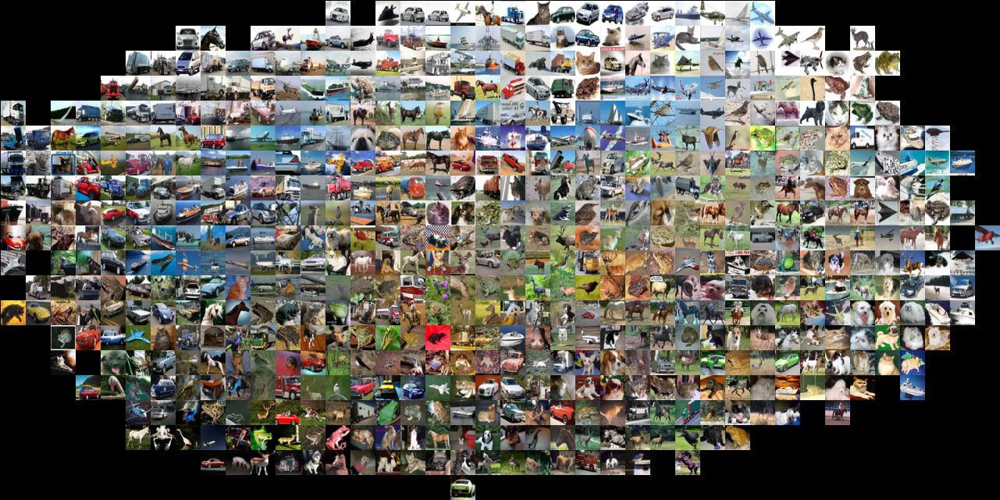

slidenumbers: true


# Deep Learning
## Lecture 1
### Dr. Kashif Rasul

###17.04.2015

---

# Image Classification

* Given an image, assign it a label
* Many problems can be reduces to this

^ We will introduce the Image Classification problem, which is the task of assigning an input image one label from a fixed set of categories. This is one of the core problems in Computer Vision that, despite its simplicity, has a large variety of practical applications.

---


^ For example a model takes a single image  and assigns probabilities to 4 labels, *{cat, dog, hat, mug}*. For the model an image is just one large 3-dimensional array of numbers. In this example, the cat image is 248 pixels wide, 400 pixels tall, and has three color channels Red,Green,Blue (or RGB for short). Therefore, the image consists of 248 x 400 x 3 numbers, or a total of 297,600 numbers. Each number is an integer that ranges from 0 (black) to 255 (white). Our task is to turn this quarter of a million numbers into a single label, such as *"cat"*.

---


^ Why is it a hard problem? Lets look at some of the challenges. Viewpoint variation: a single instance of an object can be oriented in many ways with respect to the camera. Scale variation: refers to the fact that objects often exhibit variation in their real-world size, not only in terms of their extent in the image. Deformation: many objects are not rigid and can deform in extreme ways. Occlusion: Sometimes only a small part of an object is visible. The effects of illumination can be drastic at the pixel level. Clutter: the object of interest might be blended into the environment it is in. Finally the classes of interest can often be relatively broad, such as the many types of chairs.

---

# Approach?

* How does a child learn?
* Provide algorithm with many examples of each class
* Develop learning algorithm that learn the appearance of each class

^ How might we go about writing an algorithm that can classify images into distinct categories? Instead of specifying every one of the categories of interest into code, we take a different approach. How might a child learn? We see it evaluate many different examples of each class and over time it learns to make sense of the world. This approach is referred to as a *data-driven approach*, since it relies on first accumulating a *training dataset* of labeled images.

---


^ An example training set might look like this.

---

# Classification Pipeline

* **Input**:  *N* images, each labeled with one of *K* different classes
* **Learning**: learn what every one of the classes looks like
* **Evaluation**: evaluate the quality of the classifier by asking it to predict labels for a new set of images

^ We will then compare the true labels of these images to the ones predicted by the classifier. Intuitively, we're hoping that a lot of the predictions match up with the true answers  (which we call the *ground truth*).

---


^ One popular toy image classification dataset is the CIFAR-10 dataset of 60,000 32 by 32 pixels with 10 class labels. This dataset is partitioned into 50,000 training sets and 10,000 test sets.

^ So now let us discuss our first approach: Nearest neighbor classifier. The nearest neighbor classifier will take a test image, compare it to every single one of the training images, and predict the label of the closest training image. On the right you can see an example result of such procedure for 10 example test images. Notice that in only about 3 out of 10 examples an image of the same class is retrieved, while in the other 7 examples this is not the case.

---

# Nearest Neighbor

* Compare the images pixel by pixel and add up all the differences
* Given two images and representing them as vectors $$ I_1, I_2 $$ , a reasonable choice for comparing them might be the **L1 distance**:

$$
d_1 (I_1, I_2) = \sum_{p} \left| I^p_1 - I^p_2 \right|
$$

^ Here the sum is taken over all pixels.

---


^ As an example of using pixel-wise differences to compare two images with L1 distance: Two images are subtracted elementwise and then all differences are added up to a single number. If two images are identical the result will be zero. But if the images are very different the result will be large.

---

# Implementation

* Get the data:

```
$ wget http://www.cs.toronto.edu/~kriz/cifar-10-python.tar.gz
...
$ tar xzf cifar-10-python.tar.gz
...
```

---

# Load the data/labels

* Load data into memory as 4 arrays: training data/labels and test data/labels
* Flatten the RGB image into a vector of size `32*32*3`

```python
Xtr, Ytr, Xte, Yte = load_CIFAR10('data/cifar10/')

Xtr_rows = Xtr.reshape(Xtr.shape[0], 32 * 32 * 3)
Xte_rows = Xte.reshape(Xte.shape[0], 32 * 32 * 3)
```

---

# Nearest Neighbor Classifier

```python
# create a Nearest Neighbor classifier class
nn = NearestNeighbor()

# train the classifier on the training images and labels
nn.train(Xtr_rows, Ytr)

# predict labels on the test images
Yte_predict = nn.predict(Xte_rows)

# and now print the classification accuracy, which is the average
# number of examples that are correctly predicted (i.e. label matches)
print 'accuracy: %f' % ( np.mean(Yte_predict == Yte) )
```

^ Now that we have all images stretched out as rows, here is how we could train and evaluate a classifier. Notice that as an evaluation criterion, it is common to use the **accuracy**, which measures the fraction of predictions that were correct. Notice that all classifiers we will build satisfy this one common API: train and predict. Of course, we've left out the meat of things - the actual classifier itself.

---

```python
class NearestNeighbor:
  def __init__(self):
    pass

  def train(self, X, y):
    self.Xtr = X
    self.ytr = y
  ...
```

^ Here is an implementation of a simple Nearest Neighbor classifier with the L1 distance that satisfies this template API. Our train method simply remembers all the training data.

---

```python
def predict(self, X):
  num_test = X.shape[0]
  # lets make sure that the output type matches the input type
  Ypred = np.zeros(num_test, dtype = self.ytr.dtype)

  # loop over all test rows
  for i in xrange(num_test):
    # find the nearest training image
    distances = np.sum(np.abs(self.Xtr - X[i,:]), axis = 1)
    # get the index with smallest distance
    min_index = np.argmin(distances)
    # predict the label
    Ypred[i] = self.ytr[min_index]

  return Ypred
```

^ Now our predict method finds the nearest training image to our test image and returns the label corresponding to the image with the lowest L1 distance.

---

# State of the art?

* This code achieves: 38.6% on CIFAR-10 (better than random guess: 10%)
* Human performance: about 94%
* State of the art Convolutional Neural Network: 95%

^ So the state of the art is matching human accuracy in this test example. What about trying a different distance?

---

# L2 Distance

* L2 distance: geometric interpretation of computing the euclidean distance between two vectors

$$
d_2 (I_1, I_2) = \sqrt{\sum_{p} \left( I^p_1 - I^p_2 \right)^2}
$$

* In code we only need to change:

```python
distances = np.sqrt(np.sum(np.square(self.Xtr - X[i,:]), axis = 1))
```

^ We keep the `sqrt`, but in a practical nearest neighbor application we could leave out the square root operation because square root is a *monotonic function*. That is, it scales the absolute sizes of the distances but it preserves the ordering, so the nearest neighbors with or without it are identical. If we run this our accuracy is actually 35.4%, or slightly lower than L1.

^ It is interesting to consider differences between the two metrics. In particular, the L2 distance is much more unforgiving than the L1 distance when it comes to differences between two vectors. That is, the L2 distance prefers many medium disagreements to one big one.

---

# k-Nearest Neighbor Classifier

* Instead of finding the closest image in the training set, find the top **k** closest images
* Then vote on the label of the test image from these k labels
* When k=1 we end up with original classifier
* Higher k has a smoothing effect: more resistant to outliers

---


^ An example of the difference between Nearest Neighbor and a 5-Nearest Neighbor classifier, using 2-dimensional points and 3 classes (red, blue, green). The colored regions show the decision boundaries induced by the classifier with an L2 distance. The white regions show points that are ambiguously classified (i.e. class votes are tied for at least two classes). Notice that in the case of a NN classifier, outlier data points (e.g. green point in the middle of a cloud of blue points) create small islands of likely incorrect predictions, while the 5-NN classifier smooths over these irregularities, likely leading to better generalization on any test data.

^ In practice we always use k-NN. But what should the value of k be?

---

# Hyperparameter Tuning

* What k is the best?
* Which distance metric is the best?
* All these choices are called hyperparameters
* Could try them all out?

^ That is a fine idea and that's indeed what we will do, but this must be done very carefully. Whenever you're designing Machine Learning algorithms, you should think of the test set as a very precious resource that should ideally never be touched until one time at the very end. Otherwise, the very real danger is that you may tune your hyperparameters to work well on the test set, but if you were to deploy your model you could see a significantly reduced performance.

---

> Evaluate on the test set only a single time, at the very end!

^  Another way of looking at it is that if you tune your hyperparameters on the test set, you are effectively using the test set as the training set, and therefore the performance you achieve on it will be too optimistic with respect to what you might actually observe when you deploy your model. But if you only use the test set once at end, it remains a good proxy for measuring the generalization of your classifier (we will see much more discussion surrounding generalization later in the class).

---

# Validation Set

* We could use 49,000 of the training images for training
* Leave 1,000 for validating the performance of model
* We can calculate the accuracy since we know the true labels

^ The validation set is essentially used as a fake test set to tune the hyper-parameters.

---

```python
# take first 1,000 for validation
Xval_rows = Xtr_rows[:1000, :]
Yval = Ytr[:1000]
# keep last 49,000 for training
Xtr_rows = Xtr_rows[1000:, :]
Ytr = Ytr[1000:]

validation_accuracies = []
for k in [1, 3, 5, 10, 20, 50, 100]:
    nn = NearestNeighbor()
    nn.train(Xtr_rows, Ytr)
    Yval_predict = nn.predict(Xval_rows, k = k)
    acc = np.mean(Yval_predict == Yval)
    validation_accuracies.append((k, acc))
```

^ By the end of this procedure, we could plot a graph that shows which values of *k* work best. We would then stick with this value and evaluate once on the actual test set. There are more  sophisticated technique for hyperparameter tuning called CV. We will study them in the coming weeks.

---

# Pros & Cons of NN

* It is simple to implement and understand
* Takes no time to train
* We pay computational cost at test time
* Approximate Nearest Neighbor algorithms an active area of research (e.g. FLANN)
* Rarely used in image classification

^ This is backwards, since in practice we often care about the test time efficiency much more than the efficiency at training time. In fact, the deep neural networks we will develop later in this class shift this tradeoff to the other extreme: They are very expensive to train, but once the training is finished it is very cheap to classify a new test example.

^ ANN libraries can accelerate the nearest neighbor lookup in a dataset. These algorithms allow one to trade off the correctness of the nearest neighbor retrieval with its space/time complexity during retrieval, and usually rely on a pre-processing/indexing stage that involves building a kdtree, or running the k-means algorithm.

^ One problem is that images are high-dimensional objects (i.e. they often contain many pixels), and distances over high-dimensional spaces can be very counter-intuitive.

---


^ Pixel-based distances on high-dimensional data (and images especially) can be very unintuitive. An original image (left) and three other images next to it that are all equally far away from it based on L2 pixel distance. Clearly, the pixel-wise distance does not correspond at all to perceptual or semantic similarity.

---



^ Another visualisation to convince you that using pixel differences to compare images is inadequate: t-SNE projection of the CIFAR images into two dimensions  so that their (local) pairwise distances are best preserved. In this visualization, images that are shown nearby are considered to be very near according to the L2 pixelwise distance we developed above. But closer inspection reveals that images that are nearby each other are much more a function of the general color distribution of the images, or the type of background rather than their semantic identity.

^ Ideally we would like images of all of the 10 classes to form their own clusters, so that images of the same class are nearby to each other regardless of irrelevant characteristics and variations (such as the background). However, to get this property we will have to go beyond raw pixels.

---

# Summary: kNN in practice

* Preprocess your data: normalise the data
* Reduce dimensionality
* Split training data into train/validation sets
* Train with different parameters and evaluate on validation
* If it takes too long consider Approximate NN libraries


^ If you wish to apply kNN in practice (hopefully not on images, or perhaps as only a baseline) proceed as above.

---

# Cross-validation

* Instead of picking data arbitrarily, iterate over different validation
* Then average the performance across these sets

^  For example, in 5-fold cross-validation, we would split the training data into 5 equal folds, use 4 of them for training, and 1 for validation. We would then iterate over which fold is the validation fold, evaluate the performance, and finally average the performance across the different folds.


---


^ The training set is split into folds (for example 5 folds here). The folds 1-4 become the training set. One fold (e.g. fold 5 here in yellow) is denoted as the Validation fold and is used to tune the hyperparameters. Cross-validation goes a step further iterates over the choice of which fold is the validation fold, separately from 1-5. This would be referred to as 5-fold cross-validation. In the very end once the model is trained and all the best hyperparameters were determined, the model is evaluated a single time on the test data.

---


^ Running this we get 5 accuracies on the validation fold (accuracy is the y-axis, each result is a point). The trend line is drawn through the average of the results for each k and the error bars indicate the standard deviation. Note that in this particular case, the cross-validation suggests that a value of about k = 7 works best on this particular dataset.

---

# Exercise 1
