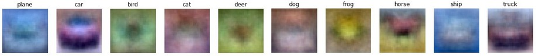

slidenumbers: true

# Deep Learning
## Lecture 2
### Dr. Kashif Rasul

###24.4.2015

---

# Last Time

*  K-NN classifier must *remember* all of the training data and store it for future comparisons
* Classifying a test image is expensive since it requires a comparison to all training images

^ Last time we described the k-Nearest Neighbor (kNN) classifier which labels images by comparing them to (annotated) images from the training set. As we saw, kNN has a number of disadvantages.

---

# Classification Strategy

* Introduce  a **score function** that maps the raw data to class scores
* **Loss function** that quantifies the agreement between the predicted scores and the ground truth labels
* Cast this as an **optimization problem**

^ Today we are going to develop a more powerful approach to image classification that we will eventually naturally extend to entire Neural Networks and Convolutional Neural Networks. This approach will have two major components.  We will then cast this as an optimization problem in which we will minimize the loss function with respect to the parameters of the score function.

---

# Mapping

* Define the score function that maps the pixel values of an image to confidence scores for each class
* Each image $$\vec{x}_i \in \mathbb{R}^D$$ with label $$y_i$$ and we have $$N$$ images and $$K$$ labels
* CIFAR-10: $$D= 32\times 32 \times 3$$, $$N=50,000$$ and $$K=10$$
* Define score function $$f \colon \mathbb{R}^D \mapsto \mathbb{R}^K$$

^ We will now define the score function f that maps the raw image pixels to class scores.

---

# Simplest

$$ f(\vec{x}_i, W, \vec{b}) =  W \vec{x}_i + \vec{b} $$

* CIFAR-10: $$W$$ is $$10 \times 3072$$ and $$\vec{b}$$ is a vector of size $$10$$

^ Let us start with the simplest mapping: a linear mapping. The matrix W (of size [K x D]), and the vector b (of size K) are the parameters of the function. So for CIFAR-10, W is a [10 x 3072] and b is [10 x 1], so 3072 numbers come into the function and 10 numbers come out (the class scores). The parameters in W are often called the weights, and b is called the bias vector because it influences the output scores, but without interacting with the actual input data.

---

# Note

* Matrix multiplication $$W \vec{x}_i$$ is effectively evaluating 10 separate classifiers in parallel (one for each class), where each classifier is a row of $$W$$
*  We have control of this matrix $$W$$ and bias $$\vec{b}$$
* Use training data to learn $$W$$ and $$\vec{b}$$ and after that we can throw training data away
* Classifying now involves 1 matrix vector multiplication and 1 vector addition

^ Our goal will be to set W and b in such way that the computed scores match the ground truth labels across the whole training set. We will go into much more detail about how this is done, but intuitively we wish that the correct class has a score that is higher than the scores of incorrect classes.

---

> Convolutional Neural Networks will map image pixels to scores  but  $$f$$  will be more complex and will contain more parameters.

---

# Interpretation

* A linear classifier computes the score of a class as a weighted sum of all of its pixel values across all 3 of its color channels
* $$f$$ has the capacity to like or dislike (depending on the sign of each weight) certain colors at certain positions in the image
* E.g. the "ship" class might be more likely if there is a lot of blue on the sides of an image

---


^ An example of mapping an image to class scores. For the sake of visualization, we assume the image only has 4 pixels and that we have 3 classes (red, blue, green class). We stretch the image pixels into a column and perform matrix multiplication to get the scores for each class. Note that this particular set of weights W is not good at all: the weights assign our cat image a very low cat score. In particular, this set of weights seems convinced that it's looking at a dog.

---


^ Since the images are stretched into high-dimensional column vectors, we can interpret each image as a single point in this space. Analogously, the entire dataset is a (labeled) set of points. Since we defined the score of each class as a weighted sum of all image pixels, each class score is a linear function over this space. We cannot visualize 3072-dimensional spaces, but if we imagine squashing all those dimensions into only two dimensions, then we can try to visualize what the classifier might be doing.

---

* Each row of $$W$$ is a classifier for one of the classes
* As we change a row of $$W$$ the  corresponding line in the pixel space will rotate in different directions
* $$\vec{b}$$ will allow our classifiers to translate the lines
* Without the bias plugging in $$\vec{x}_i = \vec{0}$$ would give a score of zero no mater what $$W$$ is, i.e. all lines would be forced to cross the origin

---

# Template Matching

* Each row of $$W$$  corresponds to a template (**prototype**) for one of the classes
* The score obtained by comparing each template with the image using a dot product one by one to find the one that "fits" best
* Linear classifier: doing template matching, where the templates are learned

^ Another way to think of it is that we are still effectively doing Nearest Neighbor, but instead of having thousands of training images we are only using a single image per class (although we will learn it, and it does not necessarily have to be one of the images in the training set), and we use the (negative) inner product as the distance instead of the L1 or L2 distance.

---



^ Skipping ahead a bit: Example learned weights at the end of learning for CIFAR-10. Note that, for example, the ship template contains a lot of blue pixels as expected. This template will therefore give a high score once it is matched against images of ships on the ocean with an inner product.

---

# Bias Trick

* Score function: $$  f(\vec{x}_i, W, \vec{b}) =  W \vec{x}_i + \vec{b} $$
* Cumbersome to keep track of two sets of parameters
*  Commonly used trick is to combine the two sets of parameters into a single matrix that holds both of them by extending the vector $$\vec{x}_i$$ with one additional dimension that always holds the constant $$1$$
* With the extra dimension: $$  f(\vec{x}_i, W) =  W \vec{x}_i  $$

^ Before moving on we want to mention a common simplifying trick to representing the two parameters W,b as one.

---


^ Illustration of the bias trick. Doing a matrix multiplication and then adding a bias vector (left) is equivalent to adding a bias dimension with a constant of 1 to all input vectors and extending the weight matrix by 1 column - a bias column (right). Thus, if we preprocess our data by appending ones to all vectors we only have to learn a single matrix of weights instead of two matrices that hold the weights and the biases.

---

# Image data preprocessing

* In Machine Learning, it is a very common practice to always perform normalization of your input features
* Important to **center your data** by subtracting the mean from every feature
* For images: compute a *mean image* across the training images and subtracting it from every image to get images where the pixels range from approximately $$[-127, 127]$$

^ Further common preprocessing is to scale each input feature so that its values range from [-1, 1]. Of these, zero mean centering is arguably more important but we will have to wait for its justification until we understand the dynamics of gradient descent.

---

# Loss function

* We saw that we set $$W$$ so that the predicted class scores are consistent with the ground truth labels in the training data
* With some initial weight we will get a bad prediction so we need to measure our unhappiness with outcomes
* We do this via a **loss function** (or sometimes also referred to as the **cost function** or the **objective**)
* The loss will be high if we're doing a poor job of classifying the training data and low if we are doing well

---

# Multiclass SVM loss

* SVM "wants" the correct class for each image to have a score higher than the wrong class by some fixed $$\Delta$$
* Define the loss for image $$\vec{x}_i$$ and label $$y_i$$ example as:

$$
L_i = \sum_{j\neq y_i} \max(0, f(\vec{x}_i, W)_j - f(\vec{x}_i, W)_{y_i} + \Delta)
$$

^ The SVM loss is set up so that the SVM "wants" the correct class for each image to a have a score higher than the incorrect classes by some fixed margin Delta. This expression may seem daunting if you're seeing it for the first time, so lets unpack it.

---

# Example: 3 classes

* Suppose: $$f(\vec{x}_i, W) = [13, -7, 11]$$ and $$y_i = 0$$ (first one is the true class) and $$\Delta = 10$$
* Loss sums over all other classes $$j \neq y_i$$ so we get:

$$ L_i = \max(0, -7 - 13 + 10) + \max(0, 11 - 13 + 10) = 0 + 8 $$

*  SVM loss wants score of the correct class $$y_i$$ to be larger than the incorrect class by at least $$\Delta$$, else we accumulate loss

^ You can see that the first term gives zero. We get zero loss for this pair because the correct class score (13) was greater than the incorrect class score (-7) by at least the margin 10. In fact the difference was 20, which is much greater than 10 but the SVM only cares that the difference is at least 10; Any additional difference above the margin is clamped at zero with the max operation.

^ The second term computes 8, i.e. even though the correct class had a higher score than the incorrect class (13 > 11), it was not greater by the desired margin of 10. The difference was only 2, which is why the loss comes out to 8 (i.e. how much higher the difference would have to be to meet the margin).

---

# Linear score functions

* At the moment we are working with linear score functions $$ f(\vec{x}_i, W) = W \vec{x}_i$$ so we can re-write the loss function as:

$$
L_i = \sum_{j\neq y_i} \max(0, w_j^T \vec{x}_i - w_{y_i}^T \vec{x}_i + \Delta),
$$
where $$w_j$$ is the $$j$$-th row of $$W$$ `reshaped` as a column

* As an aside: $$\max(0,-)$$ is called  **hinge loss**

^ Note that this will not be the case when we start to consider more complex forms of the score function.

^ You'll sometimes hear people using the squared hinge loss SVM (or L2-SVM) that penalizes violated margins more strongly (quadratically instead of linearly). The un-squared version is more standard, but in some datasets the squared hinge loss can work better. This can be determined during cross-validation.

---

> The loss function quantifies our unhappiness with predictions on the training set.

---


^ The Multiclass Support Vector Machine "wants" the score of the correct class to be higher than all other scores by at least a margin of delta. If any class has a score inside the red region (or higher), then there will be accumulated loss. Otherwise the loss will be zero. Our objective will be to find the weights that will simultaneously satisfy this constraint for all examples in the training data and give a total loss that is as low as possible. But there is still one bug with the loss function.

---

# Regularization

* Problem: the set of $$W$$ is not necessarily unique: there might be many similar $$W$$ that correctly classify the examples
* E.g. if loss is $$0$$ for some $$W$$ then $$\lambda W$$ where $$\lambda >1$$ will also give $$0$$ loss
* We need to  remove this ambiguity by encoding some  preference for a certain set of weights via  **regularization penalty**: $$R(W)$$

^ lambda W with lambda > 1 will give zero loss because this transformation uniformly stretches all score magnitudes and hence also their absolute differences. For example, if the difference in scores between a correct class and a nearest incorrect class was 15, then multiplying all elements of W by 2 would make the new difference 30.

---

# L2 Penalty

* The most common regularization penalty is the **L2** norm that discourages large weights through an element-wise quadratic penalty over all parameters:

$$
R(W) = \sum_k\sum_l w_{k,l}^2
$$


^ In the expression above, we are summing up all the squared elements of W. Notice that the regularization function is not a function of the data, it is only based on the weights.

---

# Full Multiclass SVM loss

$$
L =  \underbrace{ \frac{1}{N} \sum_i L_i }_\text{data loss} + \underbrace{ \lambda R(W) }_\text{regularization loss}
$$


Or expanding this out in its full form for $$N$$ images:

$$
L = \frac{1}{N} \sum_i \sum_{j\neq y_i} \left[ \max(0, f(\vec{x}_i, W)_j - f(\vec{x}_i, W)_{y_i} + \Delta) \right] + \lambda \sum_k\sum_l w_{k,l}^2
$$

^ As you can see, we append the regularization penalty to the loss objective, weighted by a hyperparameter lambda. There is no simple way of setting this hyperparameter and it is usually determined by cross-validation. In addition to the motivation we provided above there are many desirable properties to include the regularization penalty, many of which we will come back to in later lectures.

^ The most appealing property is that penalizing large weights tends to improve generalization, because it means that no input dimension can have a very large influence on the scores all by itself.

^ Note that biases do not have the same effect since, unlike the weights, they do not control the strength of influence of an input dimension. Therefore, it is common to only regularize the weights and not the biases.  Lastly, note that due to the regularization penalty we can never achieve loss of exactly 0.0 on all examples, because this would only be possible in the pathological setting of W=0.

---

```python
def L_i(x, y, W):
  delta = 1.0
  scores = W.dot(x) # scores becomes of size 10 x 1
  correct_class_score = scores[y]
  D = W.shape[0] # number of classes, e.g. 10
  loss_i = 0.0
  for j in xrange(D): # iterate over all wrong classes
    if j == y:
      # skip for the true class to only loop
      # over incorrect classes
      continue
    # accumulate loss for the i-th example
    loss_i += max(0, scores[j] - correct_class_score + delta)
  return loss_i
```

^ Here is the loss function (without regularization) implemented in Python. This un-vectorized version compute the multiclass svm loss for a single example image and label (x,y). x is a column vector representing an image (e.g. 3073 x 1 in CIFAR-10) with an appended bias dimension in the 3073-rd position (i.e. bias trick). y is an integer giving index of correct class  (e.g. between 0 and 9 in CIFAR-10). And W is the weight matrix (e.g. 10 x 3073 in CIFAR-10).

---

```python
def L_i_vectorized(x, y, W):
  delta = 1.0
  scores = W.dot(x)
  # compute the margins for all classes
  # in one vector operation
  margins = np.maximum(0, scores - scores[y] + delta)
  # on y-th position scores[y] - scores[y] canceled
  # and gave delta. We want to ignore the
  # y-th position and only consider margin on
  # max wrong class
  margins[y] = 0
  loss_i = np.sum(margins)
  return loss_i
```

^ Here is a faster half-vectorized implementation. Half-vectorized refers to the fact that for a single example the implementation contains no for loops, but there is still one loop over the examples (outside this function).

---

```python
def L(X, y, W):
  """
  fully-vectorized implementation :
  - X holds all the training examples as columns
    (e.g. (3072 + 1) * 50,000 in CIFAR-10)
  - y is array of integers specifying correct class
    (e.g. 50,000-D array)
  - W are weights (e.g. 10 * (3072 + 1))
  """
  # evaluate loss over all examples in X without using
  # any for loops. TODO :-)
```

^ The takeaway from this  is that the SVM loss takes one particular approach to measuring how consistent the predictions on training data are with the ground truth labels. Additionally, making good predictions on the training set is equivalent to minimizing the loss.

---

> All we have to do now is to come up with a way to find the weights that minimize the loss.

^ And we will cover this in the coming lectures. For now let use discuss some practical considerations.

---

# Setting $$\Delta$$

* What value should it be? Do we have to cross-validate it?
* Can safely set this to $$\Delta = 1.0$$
* $$\Delta$$ and $$\lambda$$ seem like two different hyperparameters, but in fact they control the same **tradeoff**
* The tradeoff between the data loss and regularization

^ The key to understanding this is that the magnitude of the weights W has direct effect on the scores (and hence also their differences): as we shrink all values inside W the score differences will become lower, and as we scale up the weights the score differences will all become higher. Therefore, the exact value of the margin between the scores e.g. Delta = 1, or Delta = 100 is in some sense meaningless because the weights can shrink or stretch the differences arbitrarily. Hence, the only real tradeoff is how large we allow the weights to grow (through the regularization strength lambda).

---

# Softmax classifier

* SVM treats outputs as scores, Softmax classifier gives probabilities
* The mapping function stays unchanged but we now interpret these scores as the unnormalized log probabilities for each class
* We replace the *hinge loss* with a **cross-entropy loss**

^ In the Softmax classifier, the function mapping f(x_i, W)=W x_i stays unchanged, but we now interpret these scores as the unnormalized log probabilities for each class and replace the hinge loss with a cross-entropy loss.

---

# Cross-Entropy Loss

$$
L_i = -\log\left(\frac{\exp (f_{y_i})}{ \sum_j \exp(f_j) }\right)
$$

or equivalently

$$ L_i = -f_{y_i} + \log\sum_j \exp(f_j) $$

where $$f_j$$ is  $$j$$-th element of the vector of class scores $$f$$

^ As before, the full loss for the dataset is the mean of the L_i over all training examples together with a regularization term R(W).

^ The above form of the function inside the log(...) is called a softmax function and it takes a vector of arbitrary real-valued scores and squashes it to a vector of values between zero and one that sum to one. The full cross-entropy loss that involves the softmax function might look scary if you're seeing it for the first time but it is relatively easy to motivate.

---

# Information Theory View

* The *cross-entropy* between a "true" distribution $$p$$ and an estimate $$q$$:

$$H(p,q) = - \sum_x p(x) \log q(x)$$

* Softmax  is  minimizing the cross-entropy between the estimated class probabilities and the "true" probabilities, i.e. where all the probability is on the correct class

^ The cross-entropy objective wants the predicted distribution to have all of its mass on the correct answer.

---

# Probabilistic interpretation

$$
\mathbb{P}(y_i \mid \vec{x}_i, W) = \frac{\exp(f_{y_i})}{\sum_j \exp(f_j) }
$$

(normalized) probability assigned to the correct label  $$y_i$$ given the image $$\vec{x}_i$$ and parameter $$W$$

^ To see this remember that the Softmax classifier interprets the scores inside the output vector f as the unnormalized log probabilities.  Exponentiating these quantities therefore gives the (unnormalized) probabilities, and the division performs the normalization so that the probabilities sum to one.

^ In the probabilistic interpretation, we are therefore minimizing the negative log likelihood of the correct class, which can be interpreted as performing Maximum Likelihood Estimation (MLE).  A nice feature of this view is that we can now also interpret the regularization term R(W) in the full loss function as coming from a Gaussian prior over the weight matrix W, where instead of MLE we are performing the Maximum a posteriori (MAP) estimation.

---

# Numeric stability

* $$\exp(f_{y_i})$$ and $$ \sum_j \exp(f_j) $$ may be very large
* Dividing large numbers can be numerically unstable

$$
\frac{\exp(f_{y_i})}{\sum_j \exp(f_j)}
= \frac{C \exp(f_{y_i})}{C \sum_j \exp(f_j)}
= \frac{\exp(f_{y_i} + \log C)}{\sum_j \exp(f_j + \log C)}
$$

* Set $$C$$ to $$ \log C = -\max_j f_j $$

^ This trick simply states that we should shift the values inside the vector f so that the highest value is zero.

---

```python
# example with 3 classes and each having large scores
f = np.array([123, 456, 789])

# ⚠️: Numeric problem, potential blowup
p = np.exp(f) / np.sum(np.exp(f))

# instead: first shift the values of f
# so that the highest number is 0:
f -= np.max(f) # f becomes [-666, -333, 0]

# safe to do, gives the correct answer
p = np.exp(f) / np.sum(np.exp(f))
```

^ In code you do this.

---


^ Example of the difference between the SVM and Softmax classifiers for one datapoint. In both cases we compute the same score vector f (e.g. by matrix multiplication in this section). The difference is in the interpretation of the scores in f: The SVM interprets these as class scores and its loss function encourages the correct class (class 2, in blue) to have a score higher by a margin than the other class scores. The Softmax classifier instead interprets the scores as (unnormalized) log probabilities for each class and then encourages the (normalized) log probability of the correct class to be high (equivalently the negative of it to be low). The final loss for this example is 1.58 for the SVM and 1.04 for the Softmax classifier, but note that these numbers are not comparable; They are only meaningful in relation to loss computed within the same classifier and with the same data.

---

# Probabilities

* Softmax classifier allows us to compute "probabilities" for all labels
* Instead of scores `[12.5, 0.6, -23.0]` we get `[0.9, 0.09, 0.01]`
* Shape of distribution dependent on $$\lambda$$
* In practice, SVM and Softmax are usually comparable

^ The softmax classifier can instead compute the probabilities of the three labels which allows you to interpret its confidence in each class. The reason we put the word "probabilities" in quotes, however, is that how peaky or diffuse these probabilities are depends directly on the regularization strength lambda.

^ The performance difference between the SVM and Softmax are usually very small, and different people will have different opinions on which classifier works better.  Compared to the Softmax classifier, the SVM is a more local objective, which could be thought of either as a bug or a feature.
