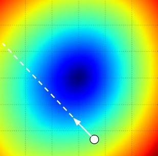
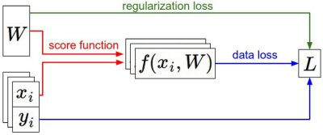

slidenumbers: true


# Deep Learning
## Lecture 3
### Dr. Kashif Rasul

###8.5.2015

---

# Last Time

* SVM score and loss:

$$
L_i = \sum_{j\neq y_i} \max(0, w_j^T \vec{x}_i - w_{y_i}^T \vec{x}_i + \Delta)
$$

* Softmax score and loss:

$$
L_i = -\log\left(\frac{\exp (f_{y_i})}{ \sum_j \exp(f_j) }\right)
$$

^ Last time  we introduced two key components in context of the image classification task: score function mapping the raw image pixels to class scores (a linear function) and loss function that measured the quality of a particular set of parameters based on how well the induced scores agreed with the ground truth labels in the training data.

^ We saw that there are many ways and versions of this (e.g. Softmax/SVM).

---

# Optimization

The process of finding the set of parameters $$W$$ that minimize this loss. Recall, for a linear $$f(\vec{x}_i,W)=W \vec{x}_i $$, the  SVM loss formulated as:


$$
L = \frac{1}{N} \sum_i \sum_{j\neq y_i} \left[ \max(0, f(\vec{x}_i, W)_j - f(\vec{x}_i, W)_{y_i} + 1) \right] + \lambda R(W)
$$

$$
R(W) = \sum_k\sum_l w_{k,l}^2
$$

^ We saw that a setting of the parameters W that produced predictions for examples x_i  consistent with their ground truth labels y_i would also have a very low loss L. So we now introduce the third concept: optimization.

^  Once we understand how these three core components interact, we will revisit the first component (the parameterized function mapping) and extend it to functions much more complicated than a linear mapping. The other two components will remain unchanged.

---

# Visualizing

* Generate a random weight matrix $$W$$
* Walk along a 1-D ray and record the loss function value along the way e.g. generate $$W_1$$ and record $$L(W + a W_1)$$ for different values of $$a$$
* Can do this in 2-D too: plot $$L(W + a W_1 + b W_2)$$ for different values of $$a$$ and $$b$$

^ The loss functions we'll look at in this class are usually defined over very high-dimensional spaces, making them difficult to visualize. However, we can still gain some intuitions about one by slicing through the high-dimensional space along rays (1 dimension), or along planes (2 dimensions).

---


^ Here is a plot of the loss function landscape for the Multiclass SVM (without regularization) for one single example  and for a hundred examples in CIFAR-10. On the left we see the loss by varying a. The middle and right show two dimensional loss slices. Note blue is low and red is high. Notice the piecewise-linear structure of the loss function. The losses for multiple examples are combined with average, so the bowl shape on the right is the average of many piece-wise linear bowls (such as the one in the middle).

---

# Piecewise-linear

* For a single example: $$L_i = \sum_{j\neq y_i} \left[ \max(0, w_j^T \vec{x}_i - w_{y_i}^T \vec{x}_i + 1) \right]$$
* So loss for each image is a sum of linear functions of $$W$$
* Each row of $$W$$ (i.e. $$w_j$$) sometimes has a positive sign in front of it and sometimes a negative

---

# Example

Consider a simple dataset that contains three 1-dimensional points and three classes, then the full loss is:

$$
\begin{align}
L_0 = & \max(0, w_1^T\vec{x}_0 - w_0^T\vec{x}_0 + 1) + \max(0, w_2^T\vec{x}_0 - w_0^T\vec{x}_0 + 1) \\
L_1 = & \max(0, w_0^T\vec{x}_1 - w_1^T\vec{x}_1 + 1) + \max(0, w_2^T\vec{x}_1 - w_1^T\vec{x}_1 + 1) \\
L_2 = & \max(0, w_0^T\vec{x}_2 - w_2^T\vec{x}_2 + 1) + \max(0, w_1^T\vec{x}_2 - w_2^T\vec{x}_2 + 1) \\
L = & (L_0 + L_1 + L_2)/3
\end{align}
$$


^ Since these examples are 1-dimensional, the data x_i and weights w_j are numbers. Looking at, for instance, w_0, some terms above are linear functions of w_0 and each is clamped at zero.

---


^ We can visualize the previous example as follows: the x-axis is a single weight and the y-axis is the loss. The data loss is a sum of multiple terms, each of which is either independent of a particular weight, or a linear function of it that is thresholded at zero. Similarly the full SVM data loss is a 30,730-dimensional version of this shape.

^ You can guess from this bowl shaped appearance that the SVM cost function is an example of a convex function. There is a large amount of literature devoted to efficiently minimizing these types of functions. Once we extend our score functions f to Neural Networks our objective functions will become non-convex, and the visualizations above will not feature bowls but complex, bumpy terrains.

^ You can also see that the kinks in the loss function (due to the max operation) technically make the loss function non-differentiable because at these kinks the gradient is not defined. However, the subgradient still exists and is commonly used instead.

---

# Optimization

* Goal: find $$W$$ that minimizes the loss function
* Motivated by a convex function, but eventually we want to optimize  Neural Networks
* First strategy: Random search

^ For those of you coming to this class with previous experience, this part might seem odd since the working example we'll use (the SVM loss) is a convex problem, but keep in mind that our goal is to eventually optimize Neural Networks where we can't easily use any of the tools developed in the Convex Optimization literature.

^ Since it is so simple to check how good a given set of parameters W is, the first (very bad) idea that may come to mind is to simply try out many different random weights and keep track of what works best.

---

```python
bestloss = float("inf") # python's float infinity

for num in xrange(1000):
  # generate random parameters
  W = np.random.randn(10, 3073) * 0.0001
  # get the loss over the entire training set
  loss = L(X_train, Y_train, W)
  if loss < bestloss:
    bestloss = loss
    bestW = W
  print 'in attempt %d the loss was %f, best %f'
    % (num, loss, bestloss)  
```

^ So we see that we try out several random weights W and some of them work better than others.

---

```python
# Assume X_test is [3073 x 10000], Y_test [10000 x 1]
# scores: 10 x 10000, the class scores for all test
scores = bestW.dot(Xte_cols)

# find the index with max score in each column
# (the predicted class)
Yte_predict = np.argmax(scores, axis = 0)

# and calculate accuracy (fraction of
# predictions that are correct)
np.mean(Yte_predict == Yte) # returns 0.1555
```

^ We can take the best weights W found by the random search and try it out on the test set. With the best randomly found W this gives an accuracy of about 15.5%. Given that guessing classes completely at random achieves only 10%, that's not a very bad outcome for a such a brain-dead random search solution!

---


> Our strategy will be to start with random weights and iteratively refine them over time to get lower loss.

^  Of course, it turns out that we can do much better. The core idea is that finding the best set of weights W is a very difficult or even impossible problem (especially once W contains weights for entire complex neural networks), but the problem of refining a specific set of weights W to be slightly better is significantly less difficult. In other words, our approach will be to start with a random W and then iteratively refine it, making it slightly better each time.

---

# Random Local Search

* Extend one foot in a random direction and then take a step **only if** it leads downhill
* Start out with a random $$W$$ and generate random perturbations $$\delta W$$
* If $$W + \delta W$$ has lower loss then update $$W$$ to this new update

^ Think of yourself as hiking on a hilly terrain with a blindfold on, and trying to reach the bottom.  In the example of CIFAR-10, the hills are 30,730-dimensional, since the dimensions of W are 3073 x 10 dims and at each point we can calculate the loss.

---

```python
# generate random starting W
W = np.random.randn(10, 3073) * 0.001
bestloss = float("inf")

for i in xrange(1000):
  step_size = 0.0001
  Wtry = W + np.random.randn(10, 3073) * step_size
  loss = L(Xtr_cols, Ytr, Wtry)
  if loss < bestloss:
    W = Wtry
    bestloss = loss
  print 'iter %d loss is %f' % (i, bestloss)
```

^ Using the same number of loss function evaluations as before (1000), this approach achieves test set classification accuracy of 21.4%. This is better, but still wasteful and computationally expensive.

---

#Following the Gradient

* Compute the **best** direction along which we should change $$W$$
* Mathematically guaranteed to be the direction of the steepest descend
* This direction will be related to the **gradient** of the loss function

^ This approach roughly corresponds to feeling the slope of the hill below our feet and stepping down the direction that feels steepest.

---

# Derivatives

* In 1-D the slope is the instantaneous rate of change of the function at any point you might be interested in
* The gradient is a generalization of slope for functions that don't take a single number but a vector of numbers
* For the 1-D case:

$$
\frac{df(x)}{dx} = \lim_{h\ \to 0} \frac{f(x + h) - f(x)}{h}
$$

^ When the functions of interest take a vector of numbers instead of a single number, we call the derivatives partial derivatives, and the gradient is simply the vector of partial derivatives in each dimension.

---

# Computing the gradient

* Numerical gradient: a slow, approximate but easy way
  - finite difference: $$\frac{f(x + h) - f(x)}{h}$$
  - centered: $$\frac{f(x + h) - f(x -h)}{2h}$$
* Analytic gradient: a fast, exact but more error-prone way that requires calculus 😱

^ There are two ways to compute the gradient and we will present both now. Note, in practice it often works better to compute the numeric gradient using the centered difference formula.

---

```python
def eval_numerical_gradient(f, x):
  fx = f(x) # evaluate f(x)
  grad = np.zeros(x.shape)
  h = 0.00001
  # iterate over all indexes in x
  it = np.nditer(x, flags=['multi_index'], op_flags=['readwrite'])
  while not it.finished:
    ix = it.multi_index
    old_value = x[ix]
    x[ix] = old_value + h # increment by h
    fxh = f(x) # evaluate f(x + h)
    x[ix] = old_value # restore to previous value (important!)

    grad[ix] = (fxh - fx) / h # compute the partial derivative
    it.iternext()
  return grad
```

^ Here is a generic function that takes a function f, a vector x to evaluate the gradient on, and returns the gradient of f at x. This code iterates over all dimensions one by one, makes a small change h along that dimension and calculates the partial derivative of some function f (loss in our case) along that dimension by seeing how much the function changed. The variable grad holds the full gradient in the end.

^ Recall that in the mathematical formulation the gradient is defined in the limit as h goes towards zero, but in practice it is often sufficient to use a very small value. Ideally, you want to use the smallest step size that does not lead to numerical issues.

---

```python
# a function that takes a single argument (the weights
# in our case) so we close over X_train and Y_train
def CIFAR10_loss_fun(W):
  return L(X_train, Y_train, W)

# random weight vector
W = np.random.rand(10, 3073) * 0.001

# get the gradient
df = eval_numerical_gradient(CIFAR10_loss_fun, W)
```

^ We can now use the function in the previous slide to compute the gradient at any point and for any function. Lets compute the gradient for the CIFAR-10 loss function at some random point in the weight space.

---

```python
# lets see the effect of multiple step sizes
for step_size_log in [-10, -9, -8, -7, -6, -5,-4,-3,-2,-1]:
  step_size = 10 ** step_size_log
  # new position in the weight space
  W_new = W - step_size * df
  loss_new = CIFAR10_loss_fun(W_new)
  print 'step size %f new loss: %f' % (step_size, loss_new)

...
# step size 1.000000e-06 new loss: 1.647802
# step size 1.000000e-05 new loss: 2.844355
# step size 1.000000e-04 new loss: 25.558142
...
```

^ The gradient tells us the slope of the loss function along every dimension, which we can use to make an update. Notice that to compute W_new we are making an update in the negative direction of the gradient df since we wish our loss function to decrease, not increase.

---



^ The gradient tells us the direction in which the function has the steepest rate of increase, but it does not tell us how far along this direction we should step. As we will see later in the lecture, choosing the step size (also called the learning rate) will become one of the most important (and most headache-inducing) hyperparameter settings in training a neural network.

^ We start at some particular spot W and evaluate the gradient (or rather its negative - the white arrow) which tells us the direction of the steepest decrease in the loss function. Small steps are likely to lead to consistent but slow progress. Large steps can lead to better progress but are more risky. Note that eventually, for a large step size we will overshoot and make the loss worse. The step size (or as we will later call it - the learning rate) will become one of the most important hyperparameters that we will have to carefully tune.

---

# Efficiency

* Evaluating the numerical gradient has complexity linear in the number of parameters
* CIFAR-10: 30730 parameters in total and therefore had to perform 30,731 evaluations of the loss function to evaluate the gradient and to perform only a single parameter update
* This problem only gets worse, since modern Neural Networks can easily have tens of millions of parameters

^ Clearly, this numerical gradient strategy an approximation and is also not scalable and we need something better.

---

# Calculus

* Derive a direct formula for the gradient
* It can be more error prone to implement
* In practice it is very common to compute the analytic gradient and compare it to the numerical gradient (**gradient checking**)

---

$$
L_i = \sum_{j\neq y_i} \left[ \max(0, w_j^T\vec{x}_i - w_{y_i}^T\vec{x}_i + \Delta) \right]
$$

Taking the gradient with respect to $$w_{y_i}$$:

$$
\nabla_{w_{y_i}} L_i = - \left( \sum_{j\neq y_i} \mathbb{I}(w_j^T\vec{x}_i - w_{y_i}^T\vec{x}_i + \Delta > 0) \right) \vec{x}_i
$$

where $$\mathbb{I}$$ is the indicator function that is one if the condition inside is true or zero otherwise. For  rows where $$j \neq y_i $$:

$$
\nabla_{w_j} L_i = \mathbb{I}(w_j^T\vec{x}_i - w_{y_i}^T\vec{x}_i + \Delta > 0) \vec{x}_i
$$

^ While the expression may look scary when it is written out, when you're implementing this in code you'd simply count the number of classes that didn't meet the desired margin (and hence contributed to the loss function) and then the data vector x_i scaled by this number is the gradient. Notice that this is the gradient only with respect to the row of W  that corresponds to the correct class.

^ Once you derive the expression for the gradient it is straight-forward to implement the expressions and use them to perform the gradient update. A proficiency at computing gradients of loss expressions (and understanding what they look like intuitively) is the single most important technical skill needed to understand and efficiently use and develop Neural Networks.

---

```python
# Vanilla Gradient Descent
while True:
  weights_grad = evaluate_gradient(loss_fun, data, weights)
  # perform parameter update
  weights += - step_size * weights_grad

# Vanilla Minibatch Gradient Descent
while True:
  # sample 256 examples
  data_batch = sample_training_data(data, 256)
  weights_grad = evaluate_gradient(loss_fun, data_batch, weights)
  # perform parameter update
  weights += - step_size * weights_grad
```

^ Now that we can compute the gradient of the loss function, the procedure of repeatedly evaluating the gradient and then performing a parameter update is called Gradient Descent. Its vanilla version looks like this. This simple loop is at the core of all Neural Network libraries. There are other ways of performing the optimization (e.g. LBFGS), but Gradient Descent is currently by far the most common and established way of optimizing Neural Network loss functions.

^ Throughout the class we will put some bells and whistles on the details of this loop (e.g. the exact details of the update equation), but the core idea of following the gradient until we're happy with the results will remain the same.

^ In large-scale applications, the training data can have on order of millions of examples. Hence, it seems wasteful to compute the full loss function over the entire training set in order to perform only a single parameter update. A very common approach to addressing this challenge is to compute the gradient over batches of the training data. This batch is then used to perform a parameter update.

---

# Summary

* Always use mini-batch gradient descent
* Check implementation with numerical gradient
* Many incorrectly refer to it as "doing SGD" but that is with a batch of 1
* The mini-batch size is a hyperparameter, but not very common to CV it

^ The mini-batch hyperparameter's choice is based on practical concerns e.g. space/time efficiency.

---



^ To summarize the dataset of pairs of (x,y) is given and fixed. The weights start out as random numbers and can change. During the forward pass the score function computes class scores, stored in vector f. The loss function contains two components: the data loss computes the compatibility between the scores f and the labels y. The regularization loss is only a function of the weights. During Gradient Descent, we compute the gradient on the weights (and optionally on data if we wish) and use them to perform a parameter update during Gradient Descent.

---

# Exercise 2
