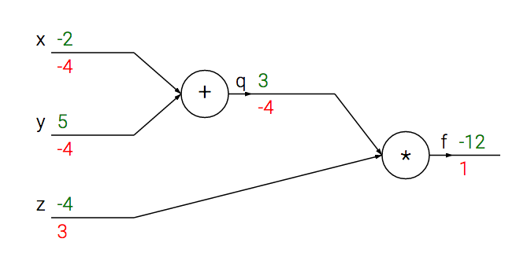
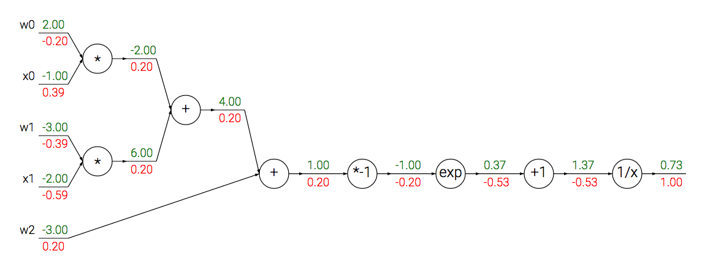
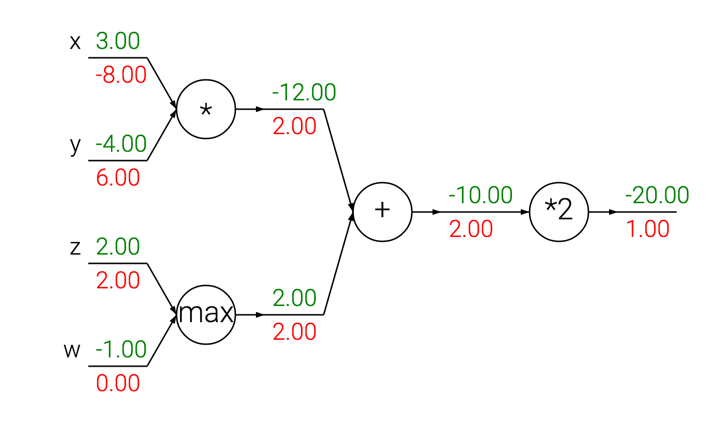

slidenumbers: true


# Deep Learning
## Lecture 4
### Dr. Kashif Rasul

###22.5.2015

---

# Last Time

* Optimization landscapes
* Local search
* Learning rate
* Analytic and numerical gradient
* Gradient Descent

---

# Today

* Intuitive understanding of **backpropagation**
* Chain rule
* Problem: given $$f(\vec{x})$$ compute $$\nabla f(\vec{x})$$

^ Today we want to develop expertise with an intuitive understanding of backpropagation, which is a way of computing gradients of expressions through recursive application of chain rule. Understanding of this process and its subtleties is critical for you to understand, and effectively develop, design and debug Neural Networks.

^ The core problem we look at is given some function f(x) where x is a vector of inputs and we are interested in computing the gradient of f at x.

---

# Motivation

* $$f$$ corresponds to the loss function
* Inputs $$\vec{x}$$ the training data and weights $$W$$ and $$\vec{b}$$
* Training data fixed, weights variable
* Usually compute the gradients for $$(W, \vec{b})$$  to perform parameter update

^ Recall that the primary reason we are interested in this problem is that in the specific case of Neural Networks, f will correspond to the loss function ( L ) and the inputs x will consist of the training data and the neural network weights.

^ Even though we can easily use backpropagation to compute the gradient on the input examples x_i, in practice we usually only compute the gradient for the parameters (e.g. W,b) so that we can use it to perform a parameter update. However, as we will see later in the class the gradient on x_i can still be useful sometimes, for example for purposes of visualization and interpreting what the Neural Network might be doing.

^ Even if you comfortable with deriving gradients with chain rule, we would still like to encourage you to pay attention since we will present a rarely developed view of backpropagation as backward flow in real-valued circuits.

---

# Derivatives

* For $$f(x,y) = x y$$ we have: $$\frac{\partial f}{\partial x} = y$$ and $$\frac{\partial f}{\partial y} = x$$
* Interpretation: $$ \frac{df(x)}{dx} = \lim_{h\ \to 0} \frac{f(x + h) - f(x)}{h} $$  
* Or when $$h$$ is s very small, then the function is well approximated by a straight line and derivative is its slope

^ What does the derivatives tell you: the rate of change of a function with respect to that variable surrounding an infinitesimally small region near a particular point.

---

# Example

* If $$x = 4$$, $$y = -3$$ then $$f(x,y) = xy =-12$$
* $$\frac{\partial f}{\partial x} = -3$$
* Effect: $$ f(x + h) = f(x) + h \frac{df(x)}{dx}$$
* Analogously: $$\frac{\partial f}{\partial y} = 4$$

^ The derivative on x tells is that if we were to increase the value of this variable by a tiny amount, the effect on the whole expression would be to decrease it (due to the negative sign), and by three times that amount.

^ Analogously  we expect that increasing the value of y  by some very small amount h  would increase the output of the function (due to the positive sign), and by 4*h.

---

> The derivative on each variable tells you the sensitivity of the whole expression on its value.

---

# Gradient $$\nabla f$$

* Vector of partial derivatives
* $$\nabla f = [\frac{\partial f}{\partial x}, \frac{\partial f}{\partial y}] = [y, x]$$
* For $$f(x,y) = x + y$$ we have: $$\nabla f = [1,1]$$
* For $$f(x,y) = \max(x, y)$$: $$\nabla f = [\mathbb{I}(x >= y), \mathbb{I}(y >= x)]$$

^ Even though the gradient is technically a vector, we will often use terms such as "the gradient on x" instead of the technically correct phrase "the partial derivative on x" for simplicity.

^ For the second example the derivative on both x and y is 1. This makes sense, since increasing either would increase the output of f and the rate of that increase would be independent of  what the actual values of x and y are (unlike the multiplication case).

^ Finally for the max: here the the (sub)gradient is 1 on the input that was larger and 0 on the other input.  Intuitively, if the inputs are (x=4, y=2) then the max is 4, so the function is not sensitive to the setting of y, i.e. if we were to increase it by a tiny amount h the function would keep outputting 4 and so the gradient is 0. If we were to change y by a large amount then the value of f would change, but the derivatives tell us nothing about the effect of such large changes on the inputs of a function.

^ So gradients are only informative for tiny, infinitesimally small changes on the inputs, as indicated by the limit in its definition.

---

# Compound expressions

* Complicated expressions involving multiple composed functions: $$f(x,y,z) = (x+y)z$$
* Break this down to $$q(x,y) = x + y$$ and $$f = q z$$
* **Chain Rule**: the correct way to "chain" these gradient expressions:

$$\frac{\partial f}{\partial x} = \frac{\partial f}{\partial q} \frac{\partial q}{\partial x}$$

^ We have seen how to compute the derivatives of both expressions separately: f is the multiplication example and q is the addition, but we do not care about the intermediate expressions.

^ In practice this is simply a multiplication of the two numbers that hold the two gradients.

---

```python
x = -2; y = 5; z = -4 # set some inputs

# perform the forward pass
q = x + y # q becomes 3
f = q * z # f becomes -12

# perform the backward pass (backpropagation) in
# reverse order: first backprop. through f = q * z
dfdz = q # df/fz = q, so gradient on z becomes 3
dfdq = z # df/dq = z, so gradient on q becomes -4

# now backprop through q = x + y
# And the multiplication here is the chain rule!
dfdx = 1.0 * dfdq # dq/dx = 1
dfdy = 1.0 * dfdq # dq/dy = 1
```

^ At the end we are left with the gradient in the variables `[dfdx,dfdy,dfdz]`, which tell us the sensitivity of the variables `x,y,z` on `f`! This is the simplest example of backpropagation. Going forward, we will want to use a more concise notation so that we don't have to keep writing the `df` part. That is, for example instead of `dfdq` we would simply write `dq`, and always assume that the gradient is with respect to the final output.


---



^ The computation can be nicely visualized with a circuit diagram. The forward pass computes values from inputs to output (shown on the top). The backward pass then performs backpropagation which starts at the end and recursively applies the chain rule to compute the gradients (shown at the bottom) all the way to the inputs of the circuit. The gradients can be thought of as flowing backwards through the circuit.

---

# Intuition

* Backpropagation is a beautifully local process
* Every gate gets some input and can compute:
    1. its output value
    2. the **local** gradient of its input with respect to its output value
* Gate can do this independently

^ Notice that the gates can do this completely independently without being aware of any of the details of the full circuit that they are embedded in. However, once the forward pass is over, during backpropagation the gate will eventually learn about the gradient of its output value on the final output of the entire circuit.

^ Chain rule says that the gate should take that gradient and multiply it into every gradient it normally computes for all of its inputs.

---

> This extra multiplication (for each input) can turn a single and relatively useless gate into a cog in a complex circuit such as an entire neural network.

^ Because of the chain rule:

---


^ The add gate received inputs [-2, 5] and computed output 3.  Its local gradient for both of its inputs is +1. The rest of the circuit computed the final value, which is 12.

^ During the backward pass in which the chain rule is applied recursively backwards through the circuit, the add gate (which is an input to the multiply gate) learns that the gradient for its output was -4. If we anthropomorphize the circuit as wanting to output a higher value (which can help with intuition), then we can think of the circuit as "wanting" the output of the add gate to be lower (due to negative sign), and with a *force* of 4.

^ To continue the recurrence and to chain the gradient, the add gate takes that gradient and multiplies it to all of the local gradients for its inputs (making the gradient on both x and y 1 * -4 = -4).

^ Notice that this has the desired effect: If x and y were to decrease (responding to their negative gradient) then the add gate's output would decrease, which in turn makes the multiply gate's output increase.

---

# Backpropagation

* Can  be thought of as gates communicating to each other
* Communication via the gradient signal
* Communicate whether they want their outputs to increase or decrease (and how strongly)

^ So in the end the final output of the circuit is higher.

---

# Modularity

* Any differentiable function can act as a gate
* Can  group multiple gates into a single gate
* Decompose a function into multiple gates

^ whenever it is convenient we can group or decompose functions into a single or multiple gates.

---

$$ f(\vec{w}, \vec{x}) = \frac{1}{1 + \exp(-(w_0 x_0 + w_1 x_1 + w_2))}$$

* We have these new gates:
  * $$f(x) = 1/x$$ and $$df/dx = -1/x^2$$
  * $$f(x) = c+x$$ and  $$df/dx =1$$
  * $$f(x) = \exp(x)$$ and $$df/dx = \exp(x)$$
  * $$f(x) = a x$$ and  $$df/dx =a$$

^ The function is made up of multiple gates. In addition to the ones described already above we have the following 4 new gates. How would this circuit look like?


---



^ We see a long chain of function applications that operates on the result of the dot product between vectors w and x. It turns out that the derivative of this function with respect to its input actually simplifies.

---
# Sigmoid function

$$ \sigma(x) = \frac{1}{1 + \exp(-x)}$$

for which

$$ \frac{d \sigma(x)}{d x} = \frac{e^{-x}}{(1+e^{-x})^2} = \sigma(x)(1-\sigma(x))$$

^ So we see if the function receives 1.0 input and computes 0.73 during the forward pass, then the local gradient would be 0.73 * (1-0.73) ~= 0.2 as the circuit computed in the previous slide, except now we did it in a single computation. Therefore, in any real practical application it would be very useful to group these operations into a single gate.

^ This function is called the sigmoid function.

---

```python
w = [2,-3,-3] # assume some random weights and data
x = [-1, -2]

# forward pass
dot = w[0]*x[0] + w[1]*x[1] + w[2]
f = 1.0 / (1 + math.exp(-dot)) # sigmoid function

# backward pass through the neuron (backpropagation)
ddot = (1 - f) * f # gradient on dot variable, using
                   # the sigmoid gradient derivation
# backprop into x
dx = [w[0] * ddot, w[1] * ddot]
# backprop into w
dw = [x[0] * ddot, x[1] * ddot, 1.0 * ddot]
```

^ And thats it, we're done! we have the gradients on the inputs to the circuit. As we see, in practice it is always helpful to break down the forward pass into stages that are easily backpropped through. For example here we created an intermediate variable dot which holds the output of the dot product between w and x. During backward pass we then successively compute (in reverse order) the corresponding variables (e.g. ddot, and ultimately dw, dx) that hold the gradients of those variables.

---

# Another example

$$ f(x,y) = \frac{x + \sigma(y)}{\sigma(x) + (x+y)^2} $$

* Completely useless, but a good example of backpropagation in practice
* Very large and complex expression if done with respect to $$x$$ and $$y$$
* Turns out we only need to know how to compute this

^ So how would we structure the forward pass of this expression in code?


---

```python
x = 3 # example values
y = -4

# sigmoid in numerator  
sigy = 1.0 / (1 + math.exp(-y))  #(1)
num = x + sigy # numerator       #(2)
# sigmoid in denominator
sigx = 1.0 / (1 + math.exp(-x))  #(3)
xpy = x + y                      #(4)
xpysqr = xpy**2                  #(5)
den = sigx + xpysqr # denominator (6)
invden = 1.0 / den               #(7)
f = num * invden # done!         #(8)
```

^ Ok so by the end of the expression we have computed the forward pass. Notice that we have structured the code in such way that it contains multiple intermediate variables, each of which are only simple expressions for which we already know the local gradients.

^ So computing the backprop pass is easy: We'll go backwards and for every variable along the way in the forward pass (sigy, num, sigx, xpy, xpysqr, den, invden) we will have the same variable, but one that begins with a d, which will hold the gradient of that variable with respect to the output of the circuit.

^ Additionally, note that every single piece in our backprop will involve computing the local gradient of that expression, and chaining it with the gradient on that expression with a multiplication.


---

```python
# backprop f = num * invden
dnum = invden # gradient on numerator (8)
dinvden = num                        #(8)

# backprop invden = 1.0 / den
dden = (-1.0 / (den**2)) * dinvden   #(7)

# backprop den = sigx + xpysqr
dsigx = (1) * dden                   #(6)
dxpysqr = (1) * dden                 #(6)

# backprop xpysqr = xpy**2
dxpy = (2 * xpy) * dxpysqr           #(5)
```

---

```python
# backprop xpy = x + y
dx = (1) * dxpy                    #(4)
dy = (1) * dxpy                    #(4)

# backprop sigx = 1.0 / (1 + math.exp(-x))
dx += ((1 - sigx) * sigx) * dsigx  #(3)
# Notice += !!

# backprop num = x + sigy
dx += (1) * dnum                   #(2)
dsigy = (1) * dnum                 #(2)

# backprop sigy = 1.0 / (1 + math.exp(-y))
dy += ((1 - sigy) * sigy) * dsigy  #(1)
```

---

# Note

* Cache forward pass variables: helpful to have some variables from the forward pass
* Gradients add up at forks: use `+=` instead of `=` to accumulate gradient when necessary

^ In practice you want to structure your code so that you cache these variables so that  they are available during backpropagation. If this is too difficult, it is possible (but wasteful) to recompute them.

^ The forward expression involves the variables x,y multiple times, so when we perform backpropagation we must be careful to use += instead of = to accumulate the gradient on these variables (otherwise we would overwrite it). This follows the multivariable chain rule in Calculus, which states that if a variable branches out to different parts of the circuit, then the gradients that flow back to it will add.

---



^ An example circuit demonstrating the intuition behind the operations that backpropagation performs during the backward pass in order to compute the gradients on the inputs. Sum operation distributes gradients equally to all its inputs. Max operation routes the gradient to the higher input. Multiply gate takes the input activations, swaps them and multiplies by its gradient.

^ The add gate always takes the gradient on its output and distributes it equally to all of its inputs, regardless of what their values were during the forward pass.

^ The max gate routes the gradient. Unlike the add gate which distributed the gradient unchanged to all its inputs, the max gate distributes the gradient (unchanged) to exactly one of its inputs (the input that had the highest value during the forward pass).

^ The multiply gate is a little less easy to interpret. Its local gradients are the input values (except switched), and this is multiplied by the gradient on its output during the chain rule. Notice that if one of the inputs to the multiply gate is very small and the other is very big, then the multiply gate will do something slightly unintuitive: it will assign a relatively huge gradient to the small input and a tiny gradient to the large input.

---

# Unintuitive effects

* If one of the inputs to the multiply gate is very small and the other is very big, then  multiply gate will do something unintuitive

* It will assign a relatively huge gradient to the small input and a tiny gradient to the large input

^ Note that in linear classifiers where the weights are dot producted w^Tx_i (multiplied) with the inputs, this implies that the scale of the data has an effect on the magnitude of the gradient for the weights. For example, if you multiplied all input data examples xi by 1000 during preprocessing, then the gradient on the weights will be 1000 times larger, and you'd have to lower the learning rate by that factor to compensate. This is why preprocessing matters a lot, sometimes in subtle ways! And having intuitive understanding for how the gradients flow can help you debug some of these cases.

---

# Gradients of vectorized operators

* All concepts extend in a straight-forward manner to matrix and vector operations
* One must pay closer attention to dimensions and transpose operations
* Matrix-Matrix multiply gradient: most tricky operation

^ The matrix-matrix multiplication (which generalizes all matrix-vector and vector-vector) is the trickiest

---

```python
# forward pass
W = np.random.randn(5, 10)
X = np.random.randn(10, 3)
D = W.dot(X)

# now suppose we had the gradient
# on D from above in the circuit

# note dD same shape as D
dD = np.random.randn(*D.shape)
#and .T gives the transpose of the matrix
dW = dD.dot(X.T)
dX = W.T.dot(dD)
```

^ Use dimension analysis! Note that you do not need to remember the expressions for dW and dX because they are easy to re-derive based on dimensions. For instance, we know that the gradient on the weights dW must be of the same size as W after it is computed, and that it must depend on matrix multiplication of X and dD (as is the case when both X,W are single numbers and not matrices). There is always exactly one way of achieving this so that the dimensions work out. For example, X is of size [10 x 3] and dD of size [5 x 3], so if we want dW and W has shape [5 x 10], then the only way of achieving this is with dD.dot(X.T), as shown above.

---

# Summary

* Do what is convenient:
  - How backpropogation is performed
  - Which parts of the forward function we think of as gates
* Helps to be aware of which parts of the expression have easy local gradients
* Work with small, explicit examples

^ The point we are making is that the details of how the backpropagation is performed, and which parts of the forward function we think of as gates, is a matter of convenience. It helps to be aware of which parts of the expression have easy local gradients, so that they can be chained together with the least amount of code and effort.

^ Some people may find it difficult at first to derive the gradient updates for some vectorized expressions. Our recommendation is to explicitly write out a minimal vectorized example, derive the gradient on paper and then generalize the pattern to its efficient, vectorized form.
