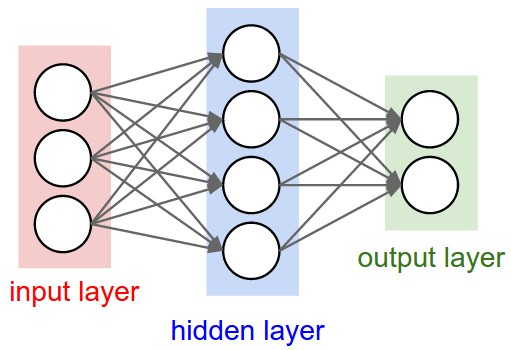
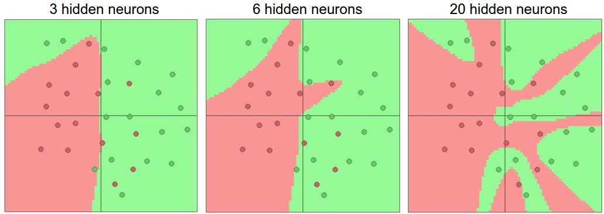

slidenumbers: true


# Deep Learning
## Lecture 5
### Dr. Kashif Rasul

###29.5.2015

---

# Last Time

* Intuitive understanding of **backpropagation**
* Chain rule

---

# Today

* Biological systems.
* Single neuron
* Neural networks

^ Today we will introduce neural networks  with a very brief and high-level description of the biological system that a large portion of this area has been inspired by. Then we modeling one neuron.

---


^ The basic unit of the brain is a neuron. There are 86 billion of then in the brain, connected with approximately 10^14-10^15 synapses. The left image is a cartoon drawing of a biological neuron (left) and a common mathematical model is on the right. Each neuron receives input signals from its dendrites and produces output signals along its (single) axon. The axon eventually branches out and connects via synapses to dendrites of other neurons.

^ In the computational model of a neuron, the signals that travel along the axons (e.g. x0) interact multiplicatively (e.g. w0x0) with the dendrites of the other neuron based on the synaptic strength at that synapse (e.g. w0). The idea is that the synaptic strengths (the weights w) are learnable and control the strength of influence (and its direction: excitory (positive weight) or inhibitory (negative weight)) of one neuron on another.

---

# Basic model

* Dendrites carry the signal to the cell body where they get summed
* If the final sum is above a certain threshold, the neuron can **fire**
* Precise timings of the spikes do not matter
* Firing rate of the neuron with an activation function $$f$$

^ In the basic model, the dendrites carry the signal to the cell body where they all get summed. If the final sum is above a certain threshold, the neuron can fire, sending a spike along its axon. In the computational model, we assume that the precise timings of the spikes do not matter, and that only the frequency of the firing communicates information. Based on this rate code interpretation, we model the firing rate of the neuron with an activation function f, which represents the frequency of the spikes along the axon.

^ Historically, a common choice of activation function is the sigmoid function.

---

```python
class Neuron:
  ...

  def forward(inputs):
    """ assume inputs and weights are 1-D
        numpy arrays and bias is a number """
    cell_body_sum = np.sum(inputs * self.weights) + self.bias

    # sigmoid activation function
    firing_rate = 1.0 / (1.0 + math.exp(-cell_body_sum))
    return firing_rate
```

^ In code each neuron performs a dot product with the input and its weights, adds the bias and applies the non-linearity (or activation function), in this case the sigmoid. We will go into more details about different activation functions later.

---

# Neuroscience view

* This is a very coarse model of a biological system
* Many different types of neurons
* Dendrites perform complex nonlinear computations
* Synapses not just a single weight
* Exact timing of the output is very important

^ Due to all these and many other simplifications, be prepared to hear groaning sounds from anyone with some neuroscience background if you draw analogies between Neural Networks and real brains. See the paper "Dendritic Computation" by Michael London and Michael Hausser and "Single neuron dynamics and computation" by Nicolas Brunel, Vincent Hakim and Magnus JE Richardson.

---

# Linear classifier

* Softmax: $$\sigma(\sum_i w_i x_i + b) = \mathbb{P}(y_i =1 | \vec{x}; \vec{w})$$
* SVM classifier: We could attach a max-margin hinge loss
* Regularization: could be viewed as  **gradual forgetting**

^ The mathematical form of the model Neuron's forward computation might look familiar to you. As we saw with linear classifiers, a neuron has the capacity to "like" (activation near one) or "dislike" (activation near zero) certain linear regions of its input space. Hence, with an appropriate loss function on the neuron's output, we can turn a single neuron into a linear classifier.

^ In the binary softmax we can formulate the cross-entropy loss and optimizing it would lead to a binary Softmax classifier (also known as logistic regression). We could alslo attach a  max-margin hinge loss to the output of the neuron and train it to become a binary SVM classifier.

^ The regularization loss  could in this biological view be interpreted as gradual forgetting, since it would have the effect of driving all synaptic weights w towards zero after every parameter update.

---

> A single neuron can be used to implement a binary classifier.

---


^ Activation function  takes a single number and performs a certain fixed mathematical operation. The  sigmoid takes a real-valued number and "squashes" it into range between 0 and 1. In particular, large negative numbers become 0 and large positive numbers become 1. The sigmoid function has seen frequent use historically since it has a nice interpretation as the firing rate of a neuron: from not firing at all (0) to fully-saturated firing at an assumed maximum frequency (1). In practice, the sigmoid non-linearity has recently fallen out of favor and it is rarely ever used.

---

# Drawbacks of Sigmoid

1. *Sigmoids saturate and kill gradients*: the gradient at tails is zero
2. *Sigmoid outputs are not zero-centered*: meaning other layers get  data that is not zero-centered

^ Recall that during backpropagation, this (local) gradient will be multiplied to the gradient of this gate's output for the whole objective. Therefore, if the local gradient is very small, it will effectively "kill" the gradient and almost no signal will flow through the neuron to its weights and recursively to its data. Also if the weights are too large, then  most neurons would become saturated and the network will barely learn.

^ 2 has implications on the dynamics during gradient descent, because if the data coming into a neuron is always positive then the gradient on the weights will during backpropagation be either all positive or all negative which can  introduce undesirable zig-zagging dynamics in the gradient updates for the weights.

^ Note that once these gradients are added up across a batch of data the final update for the weights can have variable signs, somewhat mitigating this issue. Therefore, this is an inconvenience but it has less severe consequences compared to the saturated activation problem of 2.

---


^ The tanh non-linearity squashes a real-valued number to the range [-1, 1]. Like the sigmoid neuron, its activations saturate, but unlike the sigmoid neuron its output is zero-centered. Therefore, in practice the tanh non-linearity is always preferred to the sigmoid nonlinearity.

---


^ The Rectified Linear Unit has become very popular in the last few years. It is just the max(0,x) function. In other words, the activation is simply thresholded at zero. It has several pros and cons, one pro being it greatly accelerate the convergence of stochastic gradient descent compared to the sigmoid/tanh functions. It is argued that this is due to its linear, non-saturating form.

---

# ReLU Pros & Cons

* Faster convergence
* ReLU can be implemented by simply thresholding a matrix of activations at zero
* But ReLU units are fragile and can "die"
* **Leaky ReLU**: $$f(x) = \mathbb{I}(x<0)(a x) + \mathbb{I}(x \geq 0)(x)$$ where $$a$$ is a small constant

^ For example, a large gradient flowing through a ReLU neuron could cause the weights to update in such a way that the neuron will never activate on any datapoint again. If this happens, then the gradient flowing through the unit will forever be zero from that point on. That is, the ReLU units can irreversibly die during training since they can get knocked off the data manifold. For example, you may find that as much as 40% of your network can be "dead" (i.e. neurons that never activate across the entire training dataset) if the learning rate is set too high. With a proper setting of the learning rate this is less frequently an issue.

^ Leaky ReLUs are one attempt to fix the "dying ReLU" problem. Instead of the function being zero when x < 0, a leaky ReLU will instead have a small negative slope of 0.001 for example.

---

# Maxout

* Other types that do not have functional form $$f(W^{T} \vec{x} + \vec{b})$$
* *Maxout*: $$\max(W_1^{T} \vec{x} + \vec{b}_1, W_2^{T} \vec{x} + \vec{b}_2)$$

^ The Maxout generalizes the ReLU and its leaky version and enjoys all the benefits of a ReLU unit (linear regime of operation, no saturation) and does not have its drawbacks (dying ReLU). However, unlike the ReLU neurons it doubles the number of parameters for every single neuron, leading to a high total number of parameters.

---

> Use the ReLU non-linearity.

^ Our advice: use the ReLU non-linearity, be careful with your learning rates and possibly monitor the fraction of "dead" units in a network. If this concerns you, give Leaky ReLU or Maxout a try. Never use sigmoid. Try tanh, but expect it to work worse than ReLU/Maxout.

---



^ Neural Networks are modeled as collections of neurons that are connected in an acyclic graph. Cycles are not allowed since that would imply an infinite loop in the forward pass of a network. Instead of an amorphous blobs of connected neurons, Neural Network models are often organized into distinct layers of neurons. For regular neural networks, the most common layer type is the fully-connected layer in which  neurons between two adjacent layers are fully pairwise connected, but neurons within a single layer share no connections.

---


^ Another example topology  has two hidden layers of 4 neurons each and one output layer. Notice that in both cases there are connections (synapses) between neurons across layers, but not within a layer.

^ Notice also we do not count the input layer. So a logistic regression or SVMs are simply a special case of single-layer Neural Networks.

^ Unlike all layers in a Neural Network, the output layer neurons most commonly do not have an activation function (or you can think of them as having a linear identity activation function). This is because the last output layer is usually taken to represent the class scores (e.g. in classification), which are arbitrary real-valued numbers, or some kind of real-valued target (e.g. in regression).

---

# Size of neural networks

* Number of neurons
* Number of parameters
* Number of layers

^ So in the first example, the network had 4 + 2 = 6 neurons and [3 x 4] + [4 x 2] = 20 weights and 4 + 2 = 6 biases, for a total of 26 learnable parameters.

^ The second example had 4 + 4 + 1 = 9 neurons and [3 x 4] + [4 x 4] + [4 x 1] = 12 + 16 + 4 = 32 weights and 4 + 4 + 1 = 9 biases, for a total of 41 learnable parameters.

^ Modern Convolutional Networks contain on orders of 100 million parameters and are usually made up of approximately 10-20 layers, which is where the term deep learning comes from. We will see later that the number of effective connections is however significantly greater due to parameter sharing.

---


* Input `[3x1]` vector
* All connection strengths for a layer can be stored in a single matrix
* `W1` of size `[4x3]` and bias `b` of size `[4x1]`
* `W2` is `[4x4]` and `W3` is `[1x4]`

^ One of the primary reasons that Neural Networks are organized into layers is that this structure makes it very simple and efficient to evaluate Neural Networks using matrix vector operations.

^ Every single neuron has its weights in a row of W1, so the matrix vector multiplication np.dot(W1,x) evaluates the activations of all neurons in that layer.

^ The full forward pass of this 3-layer neural network is then simply three matrix multiplications, interwoven with the application of the activation function.

---

```python
# activation function (using sigmoid :-()
f = lambda x: 1.0/(1.0 + np.exp(-x))

# random input vector of three numbers (3x1)
x = np.random.randn(3, 1)

# calculate 1st layer output (4x1)
h1 = f(np.dot(W1, x) + b1)
# calculate 2nd layer output (4x1)
h2 = f(np.dot(W2, h1) + b2)
# output neuron (1x1)
out = np.dot(W3, h2) + b3
```

^ Here W1,W2,W3,b1,b2,b3 are the learnable parameters of the network. Notice also that instead of having a single input column vector, the variable x could hold an entire batch of training data (where each input example would be a column of x) and then all examples would be efficiently evaluated in parallel. Notice that the final Neural Network layer usually doesn't have an activation function (e.g. it represents a (real-valued) class score in a classification setting).

---

> The forward pass of a fully-connected layer corresponds to one matrix multiplication followed by a bias offset and an activation function.

---

# Representational power

* Neural Networks with at least one hidden layer are **universal approximators**: for any continuous $$f(x)$$ there is a NN $$g(x)$$ with one hidden layer such that $$\forall x$$, $$|f(x)-g(x)|< \epsilon$$ for some $$\epsilon > 0$$

* But why use more layers?

^ What is the representational power of this family of functions  that are parameterized by the weights of a fully connected neural network? In particular, are there functions that cannot be modeled with a Neural Network? It can be shown that

^ A two-layer Neural Network is a universal approximator is, while mathematically cute, a relatively weak and useless statement in practice. In one dimension, the "sum of indicator bumps" function  is also a universal approximator, but no one would suggest that we use this functional form in Machine Learning. Neural Networks work well in practice because they compactly express nice, smooth functions that fit well with the statistical properties of data we encounter in practice, and are also easy to learn using our optimization algorithms

^ Similarly, the fact that deeper networks (with multiple hidden layers) can work better than a single-hidden-layer networks is an empirical observation, despite the fact that their representational power is equal.

---



^ How do we decide on what architecture to use when faced with a practical problem? Should we use no hidden layers? One hidden layer? Two hidden layers? How large should each layer be? First, note that as we increase the size and number of layers in a Neural Network, the capcacity of the network increases. That is, the space of representable functions grows since the neurons can collaborate to express many different functions. For example, suppose we had a binary classification problem in two dimensions. We could train three separate neural networks, each with one hidden layer of some size and obtain the following classifiers.

^ In the diagram above, we can see that Neural Networks with more neurons can express more complicated functions. However, this is both a blessing (since we can learn to classify more complicated data) and a curse (since it is easier to overfit the training data). Overfitting occurs when a model with high capacity fits the noise in the data instead of the (assumed) underlying relationship. For example, the model with 20 hidden neurons fits all the training data but at the cost of segmenting the space into many disjoint red and green decision regions. The model with 3 hidden neurons only has the representational power to classify the data in broad strokes. It models the data as two blobs and interprets the few red points inside the green cluster as outliers (noise). In practice, this could lead to better generalization on the test set.

---


^ It seems that smaller neural networks can be preferred if the data is not complex enough to prevent overfitting. However, this is incorrect - there are many other preferred ways to prevent overfitting in Neural Networks that we will discuss later (such as L2 regularization, dropout, input noise). In practice, it is always better to use these methods to control overfitting instead of the number of neurons.

^ The subtle reason behind this is that smaller networks are harder to train with local methods such as Gradient Descent: It's clear that their loss functions have relatively few local minima, but it turns out that many of these minima are easier to converge to, and that they are bad (i.e. with high loss). Conversely, bigger neural networks contain significantly more local minima, but these minima turn out to be much better in terms of their actual loss. Since Neural Networks are non-convex, it is hard to study these properties mathematically, but some attempts to understand these objective functions have been made.

^ In practice, what you find is that if you train a small network the final loss can display a good amount of variance - in some cases you get lucky and converge to a good place but in some cases you get trapped in one of the bad minima. On the other hand, if you train a large network you'll start to find many different solutions, but the variance in the final achieved loss will be much smaller. In other words, all solutions are about equally as good, and rely less on the luck of random initialization.

^ Here we look at the results achieved by three different regularization strength settings. The takeaway is that you should not be using smaller networks because you are afraid of overfitting. Instead, you should use as big of a neural network as your computational budget allows, and use other regularization techniques to control overfitting.

---

# References

* [Approximation by Superpositions of Sigmoidal Function](http://www.dartmouth.edu/~gvc/Cybenko_MCSS.pdf)
* [A visual proof that neural nets can compute any function](http://neuralnetworksanddeeplearning.com/chap4.html)
* [Deep Learning](http://www.iro.umontreal.ca/~bengioy/dlbook/)
* [Do Deep Nets Really Need to be Deep?](http://arxiv.org/abs/1312.6184)
* [FitNets: Hints for Thin Deep Nets](http://arxiv.org/abs/1412.6550)
* [The Loss Surfaces of Multilayer Networks](http://arxiv.org/abs/1412.0233)

^ As an aside, in practice it is often the case that 3-layer neural networks will outperform 2-layer nets, but going even deeper (4,5,6-layer) rarely helps much more. This is in stark contrast to Convolutional Networks, where depth has been found to be an extremely important component for a good recognition system (e.g. on order of 10 learnable layers). One argument for this observation is that images contain hierarchical structure (e.g. faces are made up of eyes, which are made up of edges, etc.), so several layers of processing make intuitive sense for this data domain.

^ The full story is, of course, much more involved and a topic of much recent research. If you are interested in these topics we recommend for further reading.
